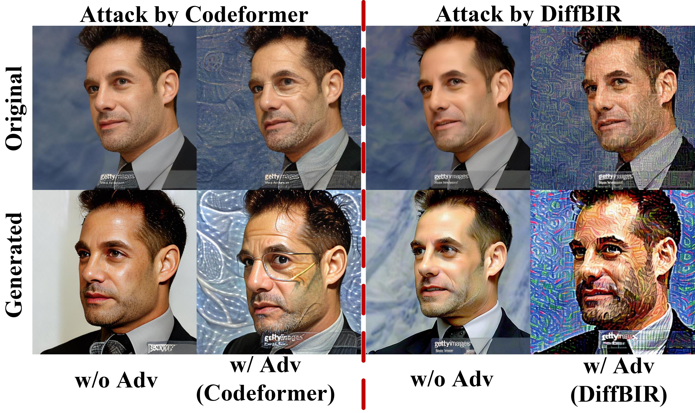

# :book: Red Teaming Protective Perturbation: Blind Face Restoration as an Attack Strategy

This repo is for the code of restoration-adaptive protection scheme.

<div style="text-align: center;">
    
</div>

## :zap: Restoration-Adaptive Protection

Model weight for restoration models: [DiffBIR](https://huggingface.co/lxq007/DiffBIR/resolve/main/face_swinir_v1.ckpt), [Codeformer](https://github.com/sczhou/CodeFormer/releases/download/v0.1.0/codeformer.pth)


## :lock: Applying Protection 

```
bash scripts/train_(codeformer/diffbir).sh %s %s'%(input_path, output_path)
```
(The codeformer weight can be automatically download while the diffbir weight should be downloaded and modify the path in DiffBIR_adapt line 858)

## :unlock: restoration attack

Please refer to [DiffBIR](https://github.com/XPixelGroup/DiffBIR), [Codeformer](https://github.com/sczhou/CodeFormer) to launch the restoration attack.

Codeformer inference:
```
python inference_codeformer.py -w 0.5 --has_aligned --input_path --output_path
```
DiffBIR inference:
```
python -u inference.py \--task face \--upscale 1 \--version v2 \--sampler spaced \--steps 50 \--captioner none \--pos_prompt \'\' \--neg_prompt \'low quality, blurry, low-resolution, noisy, unsharp, weird textures\' \--cfg_scale 4.0 \--input  --output CAAT_atkpdm_v3_wm_diffbir/%s --device cuda --precision fp32
```


